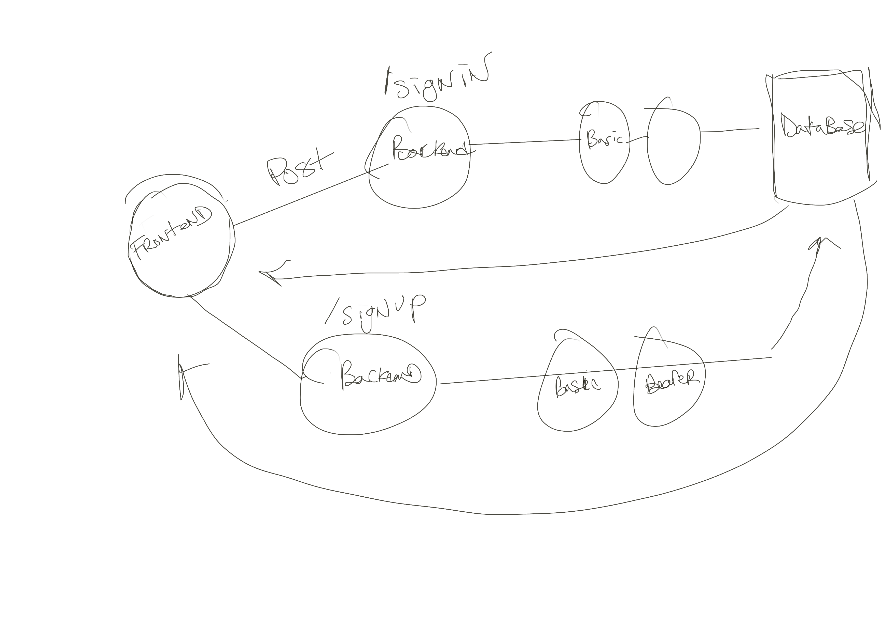

# Auth Module Final Project
# lab-09-frontend
Create a new application using your API Server and Authentication System

# Authors - Tek Jones, Sunny Lee
---

## Deployment frontend - https://affectionate-mccarthy-a27bd4.netlify.app
## Deployment backend - https://lab401-09.herokuapp.com/
---

## run start
- npm start

## UML - 

## Routes to backend
/signup
- to backend database
- recieve user.data

/signin
- to backend database
- recieve user.data

